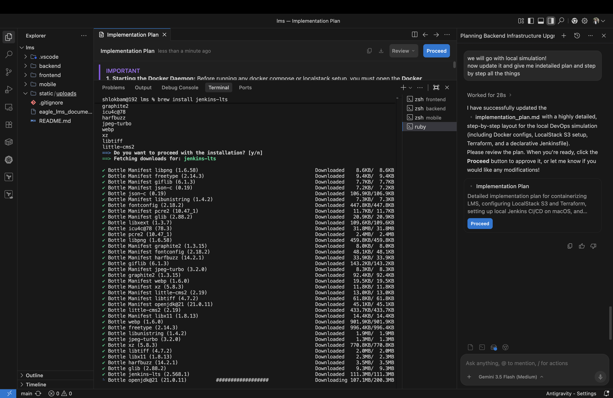

# 🛡️ DevOps & Local Cloud Simulation Log (Proof of Concept)

This document serves as engineering proof for the containerization, local cloud storage (AWS S3), infrastructure as code (Terraform), and automated CI/CD pipeline (Jenkins) integrated into the **Eagle LMS** project.

---

## 🛠️ Phase 1: Containerization & Port Bind Resolution

We containerized the entire stack using Docker Compose. During initial boot, a port conflict was detected on host port `3306` due to a native MySQL instance running on the host Mac.

### The Conflict

### The Resolution
We modified `docker-compose.yml` to expose the MySQL container on host port `3307` while retaining internal container communication on port `3306`. This isolated the stack completely.

---

## ☁️ Phase 2: Infrastructure as Code (Terraform & LocalStack S3)

We deployed a local instance of **LocalStack** to mock AWS services without cost. We wrote Terraform scripts to declare the S3 storage bucket.

### DNS & Path-Style Issues
Initially, the AWS provider attempted to resolve virtual-host-style routing (`http://eagle-lms-uploads.localhost:4566/`), resulting in DNS resolution failures and connection refusals:

### The Resolution
We reconfigured `infra/providers.tf` to force path-style routing (`s3_use_path_style = true`), resolving local requests to `http://localhost:4566/eagle-lms-uploads`. The apply completed successfully:

### S3 Verification via AWS CLI
We executed `aws --endpoint-url=http://localhost:4566 s3 ls` to prove the bucket resides in our local cloud:

---

## 🔌 Phase 3: Seeding & Backend Proxy Integration

With the database and storage services online, we ran into an empty-database and container-proxy communication issue on the web frontend.

### Authentication & Proxy Errors
*   **The Issue:** Because Vite was running inside a container, proxying traffic to `http://localhost:8000` failed since `localhost` resolved to the frontend container itself. Furthermore, the fresh MySQL database lacked tables and default credentials.

### The Resolution
1.  **Proxy:** Replaced `localhost` with the container name `backend` in `frontend/vite.config.js`.
2.  **Seeding:** Updated `backend/main.py` to auto-create tables and inject demo credentials on container boot.

After container restart, login was successful, and API interactive documentation was verified online:

---

## 🚦 Phase 4: Automated CI/CD (Local Jenkins Pipeline)

We set up a local Jenkins controller via Homebrew to automate our builds and tests.

### Jenkins Security Configuration
Modern Jenkins blocks checking out from local Git directories. We accessed the Jenkins Script Console and executed Groovy code to allow local Git checkouts for this simulation:

*(Additionally, the JVM arguments were saved permanently inside `/opt/homebrew/Cellar/jenkins-lts/2.568.1/homebrew.mxcl.jenkins-lts.plist`).*

### Pipeline SCM Configuration
We configured the pipeline to target the local Git repository on the host machine:

### 🏆 The Final Green Pipeline Build
Our declarative `Jenkinsfile` runs the entire lifecycle (Checkout ➡️ Backend Unit Tests ➡️ Terraform Validation ➡️ Docker Verify Build) on every repository pull. 

**Build #8 completed with all stages successfully passing:**

